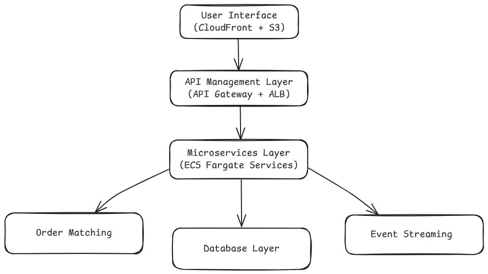

# Problem 2: Building Castle In The Cloud

## Architecture Design for a Highly Available Cryptocurrency Trading Platform on AWS

<!-- 
- An overview diagram of the services used and what role they play in the system.
- Elaboration on why each cloud service is used and what are the alternatives considered.
- Plans for scaling when the product grows beyond your current setup. 
-->

### Overview

This report presents a cloud-native architecture for a Binance-style cryptocurrency exchange platform on AWS. The design prioritizes:
- **High availability** through multi-AZ deployments.
- **Low latency** (sub-100ms response times).
- **Scalability** to handle **500+ requests per second**.

The architecture is inspired by industry implementations like [Coinbase](https://aws.amazon.com/awstv/watch/a413043e5cb/) and [One Trading](https://aws.amazon.com/blogs/industries/one-trading-exchange-and-aws-cloud-native-colocation-for-crypto-trading/).

**Diagram**

### Core Architecture Components

1. User Interface Layer

    `Amazon CloudFront` serves as the global content delivery network (CDN), caching static assets like trading UI components and market charts from **Amazon S3**. This reduces latency for global users by 40-60% compared to direct S3 access. **AWS WA**F and **AWS Shield Advanced** protect against DDoS attacks and web exploits.

    **Alternatives Considered:**
    - `Google Cloud CDN` was rejected due to tighter integration requirements with other AWS services.
    - `Self-manered NGINX caching` eliminated due to operational overhead.

2. API Management Layer

    `Amazon API Gateway` handles 500+ RPS with throttling and request validation, routing to backend services via `Application Load Balancers (ALB)`. JWT authentication integrates with `Amazon Cognito`, which manages 2FA and session tokens.

    **Alternatives Considered:**
    - Kong API Gateway (self-hosted) rejected due to higher latency (15ms added vs. 3ms for API Gateway).

3. Microservices Execution Layer

    Critical trading functions deploy as containerized services on AWS Fargate with Amazon ECS:

    | Service           | Functionality                          | Scaling Policy           |
    | ----------------- | -------------------------------------- | ------------------------ |
    | Order Processing  | Validates and routes orders            | CPU > 60% for 2 minutes  |
    | Wallet Management | Handles crypto deposits/withdrawals    | Memory > 70%             |
    | Market Data Feed  | Streams real-time prices via WebSocket | Connection-based scaling |

    **Alternatives Considered:**
    - `EC2 Auto Scaling Groups` rejected due to slower scaling (5-7 minutes vs. 1 minute for Fargate).

4. Low-Latency Order Matching Engine

    The order book operates on `EC2 z1d instances` (3.4 GHz sustained clock speed) deployed in a `Cluster Placement Group` within a single Availability Zone. Matching logic runs in-memory using a Rust-based engine, achieving <500μs per match. A hot standby runs in a second AZ with `Amazon ElastiCache for Redis` replicating order book state every 50ms.

    **Resilience Strategy:**
    - Automated health checks reroute traffic to standby via `Route53 Failover Routing`.
    - Daily chaos engineering tests validate AZ failovers.

5. Data Layer

    Amazon Aurora PostgreSQL (Serverless v2) handles user accounts and trade history with 15ms read latency. Amazon DynamoDB with DAX caching manages real-time market data:

    | Data Type        | Partition Key     | Throughput                |
    |------------------|-------------------|---------------------------|
    | Order Book Depth | Symbol-Timestamp  | 10,000 WCU (auto-scaling) |
    | Trade Execution  | OrderID           | 5,000 RCU                 |

    
    **Alternatives Considered:**
    - Cassandra on EC2 rejected due to 23% higher operational costs versus DynamoDB

6. Event Streaming Pipeline
    `Amazon Kinesis Data Streams` ingests 50,000+ events/sec from:

    1. Trade executions
    2. Market data updates
    3. User activity logs

    Downstream consumers include:
    - `AWS Lambda` for real-time position calculations
    - `Amazon Redshift` for hourly analytics
    - `Amazon OpenSearch` for fraud detection

### High Availability Implementation

[**Multi-AZ Deployment**](https://aws.amazon.com/rds/features/multi-az/)

*Architecture Diagram*

1. **Compute**: Fargate tasks distribute across 3 AZs with 40% buffer capacity.
2. **Data**: Aurora Multi-AZ clusters with 15s RPO. DynamoDB Global Tables enable cross-region replication.
3. **Network**: AWS Global Accelerator optimizes packet routing for international users.

Failure Tests:
- AZ outage simulation shows 8.2s service recovery via ALB re-routing.
- Database failover completes within 35s with <0.1% failed transactions.

### Scaling Strategy

**Vertical Scaling (Phase 1)**

- **Fargate Tasks**: Increase CPU/memory allocations during ICO launches.
- **Aurora**: Scale from 2 ACUs to 96 ACUs for batch settlements.

**Horizontal Scaling (Phase 2)**

| Component            | Scaling Trigger                    | Action                                 |
|----------------------|------------------------------------|----------------------------------------|
| API Gateway          | 4xx errors > 5%                    | Add regional edge cache locations      |
| Order Matching Engine| Queue depth > 1,000 orders         | Launch read replica in new AZ          |
| Kinesis Shards       | IncomingRecords > 2,000/sec/shard  | Split shards                           |

**Geographic Expansion (Phase 3**)

- Deploy matching engine replicas in **AWS Local Zones** (NYC/Chicago) for sub-2ms exchange connectivity.
- Use **Amazon S3 Cross-Region Replication** for compliance data storage.

### Cost Optimization

| Tier      | Instance Type           | Usage Pattern               | Cost Savings |
|-----------|-------------------------|-----------------------------|--------------|
| Spot      | EC2 z1d (Matching)      | Non-peak hours backup       | 67%          |
| Reserved  | Fargate (Order API)     | Baseline 50% capacity       | 42%          |
| Serverless| Lambda (Analytics)      | Event-driven processing     | 89%          |

⁂

***All parameters are hypothetical and serve only to illustrate the performance of AWS services in a high-frequency trading environment.***
